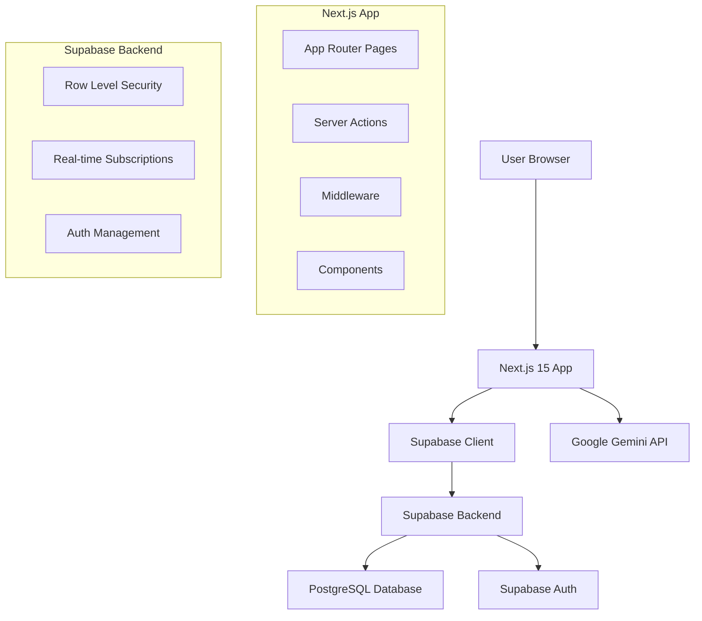

# Design Document

## Overview

Narrate is a full-stack journaling application built with Next.js 15 App Router, featuring a clean, minimal interface for daily journaling with AI-powered weekly insights. The application emphasizes security, user experience, and seamless integration between the frontend, Supabase backend, and Google Gemini AI services.

## Architecture

### High-Level Architecture



### Technology Stack

- **Frontend**: Next.js 15 with App Router, React 18, Tailwind CSS 4
- **Backend**: Supabase (PostgreSQL, Auth, Real-time)
- **AI Integration**: Google Gemini API
- **Deployment**: Vercel
- **Authentication**: Supabase Auth with email/password

## Components and Interfaces

### Core Components Structure

```
src/
├── app/
│   ├── (auth)/
│   │   ├── login/
│   │   ├── signup/
│   │   └── forgot-password/
│   ├── dashboard/
│   ├── globals.css
│   ├── layout.tsx
│   └── page.tsx
├── components/
│   ├── ui/
│   │   ├── Button.tsx
│   │   ├── Input.tsx
│   │   ├── Modal.tsx
│   │   └── TextArea.tsx
│   ├── auth/
│   │   ├── AuthForm.tsx
│   │   └── ProtectedRoute.tsx
│   ├── journal/
│   │   ├── EntryForm.tsx
│   │   ├── EntryList.tsx
│   │   ├── EntryItem.tsx
│   │   └── WeeklySummaryModal.tsx
│   └── layout/
│       ├── Header.tsx
│       └── Navigation.tsx
├── lib/
│   ├── supabase/
│   │   ├── client.ts
│   │   ├── server.ts
│   │   └── middleware.ts
│   ├── ai/
│   │   └── gemini.ts
│   ├── utils/
│   │   ├── date.ts
│   │   └── validation.ts
│   └── types/
│       └── database.ts
└── middleware.ts
```

### Key Interfaces

#### Database Types

```typescript
interface Profile {
  id: string;
  username?: string;
  created_at: string;
}

interface JournalEntry {
  id: string;
  user_id: string;
  content: string;
  created_at: string;
}

interface WeeklySummary {
  summary: string;
  theme: string;
  period: {
    start: string;
    end: string;
  };
}
```

#### Component Props

```typescript
interface EntryFormProps {
  onSave: (content: string) => Promise<void>;
  isLoading: boolean;
}

interface EntryListProps {
  entries: JournalEntry[];
  isLoading: boolean;
}

interface WeeklySummaryModalProps {
  isOpen: boolean;
  onClose: () => void;
  summary: WeeklySummary | null;
  isGenerating: boolean;
}
```

## Data Models

### Supabase Database Schema

#### Profiles Table

```sql
CREATE TABLE profiles (
  id UUID REFERENCES auth.users(id) PRIMARY KEY,
  username TEXT,
  created_at TIMESTAMP WITH TIME ZONE DEFAULT NOW()
);

-- Enable RLS
ALTER TABLE profiles ENABLE ROW LEVEL SECURITY;

-- Policy: Users can only see and edit their own profile
CREATE POLICY "Users can view own profile" ON profiles
  FOR SELECT USING (auth.uid() = id);

CREATE POLICY "Users can update own profile" ON profiles
  FOR UPDATE USING (auth.uid() = id);
```

#### Entries Table

```sql
CREATE TABLE entries (
  id UUID DEFAULT gen_random_uuid() PRIMARY KEY,
  user_id UUID REFERENCES profiles(id) ON DELETE CASCADE,
  content TEXT NOT NULL,
  created_at TIMESTAMP WITH TIME ZONE DEFAULT NOW()
);

-- Enable RLS
ALTER TABLE entries ENABLE ROW LEVEL SECURITY;

-- Policy: Users can only access their own entries
CREATE POLICY "Users can view own entries" ON entries
  FOR SELECT USING (auth.uid() = user_id);

CREATE POLICY "Users can insert own entries" ON entries
  FOR INSERT WITH CHECK (auth.uid() = user_id);

CREATE POLICY "Users can update own entries" ON entries
  FOR UPDATE USING (auth.uid() = user_id);

CREATE POLICY "Users can delete own entries" ON entries
  FOR DELETE USING (auth.uid() = user_id);
```

### Data Flow Patterns

#### Authentication Flow

1. User submits credentials → Supabase Auth
2. Auth success → Create/update profile
3. Set session → Redirect to dashboard
4. Middleware validates session on protected routes

#### Journal Entry Flow

1. User writes entry → Client validation
2. Submit via Server Action → Server validation
3. Insert to Supabase → RLS enforcement
4. Real-time update → UI refresh

#### Weekly Summary Flow

1. User clicks "Generate Summary" → Server Action
2. Fetch last 7 days entries → Supabase query
3. Format entries → Gemini API call
4. Process AI response → Return to client
5. Display in modal → User interaction

## Error Handling

### Client-Side Error Handling

```typescript
// Error boundary for React components
class JournalErrorBoundary extends React.Component {
  // Handle component errors gracefully
}

// API error handling
const handleApiError = (error: Error) => {
  if (error.message.includes('auth')) {
    // Redirect to login
  } else if (error.message.includes('network')) {
    // Show retry option
  } else {
    // Show generic error message
  }
};
```

### Server-Side Error Handling

```typescript
// Server Action error handling
export async function saveEntry(content: string) {
  try {
    // Validation
    if (!content.trim()) {
      return { error: 'Entry content cannot be empty' };
    }

    // Database operation
    const { data, error } = await supabase
      .from('entries')
      .insert({ content, user_id });

    if (error) throw error;

    return { success: true, data };
  } catch (error) {
    console.error('Save entry error:', error);
    return { error: 'Failed to save entry. Please try again.' };
  }
}
```

### Error States and User Feedback

- **Loading States**: Skeleton loaders and spinners
- **Empty States**: Encouraging messages for new users
- **Error States**: Clear error messages with retry options
- **Network Errors**: Offline indicators and retry mechanisms
- **Validation Errors**: Inline form validation with helpful messages

## Testing Strategy

### Unit Testing

- **Components**: React Testing Library for UI components
- **Utilities**: Jest for helper functions and validation
- **API Functions**: Mock Supabase and Gemini API calls

### Integration Testing

- **Authentication Flow**: End-to-end auth scenarios
- **Database Operations**: Test RLS policies and CRUD operations
- **AI Integration**: Mock Gemini API responses

### End-to-End Testing

- **User Journeys**: Complete workflows from login to summary generation
- **Cross-browser**: Ensure compatibility across modern browsers
- **Responsive**: Test on various screen sizes

### Security Testing

- **RLS Verification**: Ensure users cannot access others' data
- **Input Validation**: Test against XSS and injection attacks
- **Authentication**: Verify session management and route protection

### Performance Testing

- **Page Load Times**: Optimize for Core Web Vitals
- **Database Queries**: Ensure efficient data fetching
- **AI API Calls**: Handle rate limits and timeouts

## Security Considerations

### Authentication Security

- Secure session management with Supabase Auth
- Protected routes with middleware validation
- Automatic session refresh handling

### Data Security

- Row-Level Security on all user data
- Input sanitization and validation
- Secure API key management with environment variables

### API Security

- Server-side only AI API calls
- Rate limiting on summary generation
- Input validation before AI processing

## Performance Optimizations

### Frontend Optimizations

- Next.js App Router with automatic code splitting
- Optimistic UI updates for better perceived performance
- Lazy loading for non-critical components
- Image optimization with Next.js Image component

### Backend Optimizations

- Efficient database queries with proper indexing
- Connection pooling with Supabase
- Caching strategies for frequently accessed data

### AI Integration Optimizations

- Debounced summary generation requests
- Caching of recent summaries
- Graceful handling of API rate limits
